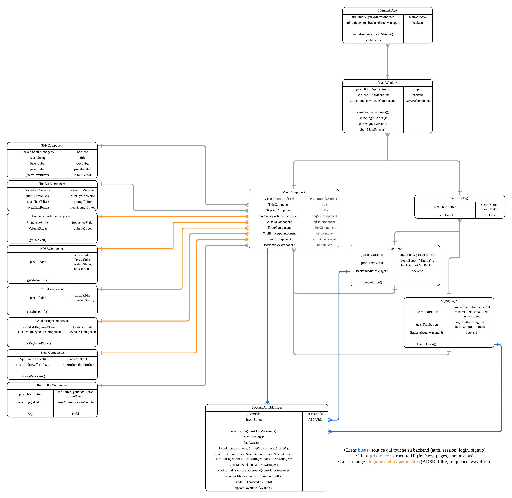

# Harmonia App – JUCE Frontend

Epitech Innovation Project (EIP)

Harmonia App is a desktop application developed in **C++ (C++17) using JUCE**, designed as the user interface for the Harmonia project.
This repository represents the **application frontend**, built to support advanced audio features such as DSP, synthesis, and plugins.

This repository provides:

A **standalone desktop application**
A **VST3 plugin**
A shared core for audio + UI logic

---

## 🔗 Links

* GitHub Repository: https://github.com/Harmonia-EIP/Harmonia-App
* Documentation: https://harmonia-eip.github.io/Harmonia-App/

---

## Features

* Modern desktop UI (JUCE)
* VST3 plugin support
* Audio synthesis (DSP, filters, ADSR)
* Modular architecture (Core / App / Plugin)
* Backend integration (HTTP via CPR)
* Cross-platform build system (CMake)

---

## Academic Context

* Developed as part of the **Epitech Innovation Project (EIP)**

---


## Architecture

### Component Diagram



```
src/
├─ app/        # Standalone application (EXE)
├─ plugin/     # JUCE plugin (VST3 / Standalone wrapper)
├─ shared/     # Core logic (audio, UI components, models, tools)
│   ├─ components/
│   ├─ parameters/
│   ├─ themes/
│   ├─ backendManagement/
│   └─ ...
```

### Layers

* **HarmoniaCore** → shared logic (audio + UI + backend)
* **HarmoniaApp** → standalone executable
* **HarmoniaPlugin** → VST3 plugin

## Technologies Used

* **C++17**
* **JUCE 8**
* **CMake**
* **Visual Studio 2022**
* **CPR (HTTP client)**
* **nlohmann/json*

---

## Requirements

* Windows 10+
* Git (with submodules)
* CMake ≥ 3.21
* Visual Studio 2022 (C++ workload installed)

---

## Quick Start

```bash
git clone --recurse-submodules https://github.com/Harmonia-EIP/Harmonia-App.git
cd Harmonia-App

cmake -S . -B build
cmake --build build --config Release
```

## Build Outputs

After build, you get:

### Standalone App

```
build/Release/HarmoniaApp.exe
```

---

### VST3 Plugin

```
build/HarmoniaPlugin_artefacts/Release/VST3/HarmoniaPlugin.vst3
```

Copy this file into your DAW VST3 folder.

---

## Run

### Standalone

```bash
build/Release/HarmoniaApp.exe
```

### Plugin

Load the plugin in your DAW (Ableton, FL Studio, etc.)

---

## Installation

### Clone with submodules

```bash
git clone --recurse-submodules https://github.com/Harmonia-EIP/Harmonia-App.git
cd Harmonia-App
```

### If already cloned

```bash
git submodule update --init --recursive
```


##  Goals

* Provide a **modern and responsive audio UI**
* Support **real-time audio synthesis**
* Enable **plugin-based workflows (VST3)**
* Connect with backend services for advanced features (AI, presets, etc.)

---

## Important Notes

* `build/` is auto-generated
* JUCE is included as a submodule
* Do not modify JUCE directly

---

## 👥 Team

Developed as part of the Epitech Innovation Project (EIP)

---

## 📝 License

Academic project
License to be defined as the project evolves
